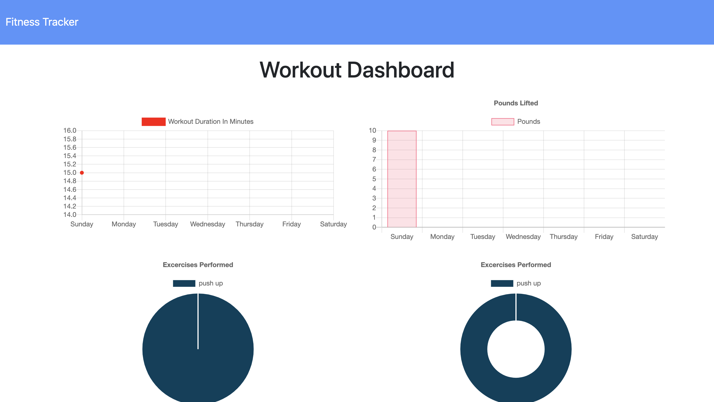

# Workout Tracker :calendar:

This is a workout tracker app. workout tracker app is build with Mongo database with a Mongoose schema and handle routes with Express.
As a user, I want to be able to view create and track daily workouts. I want to be able to log multiple exercises in a workout on a given day. I should also be able to track the name, type, weight, sets, reps, and duration of exercise. If the exercise is a cardio exercise, I should be able to track my distance traveled.
A consumer will reach their fitness goals quicker when they track their workout progress.

## Technologies Implemented

:one: Bootstrap
:two: Express
:three: Node.js
:four: MongoDB
:five: Heroku

### demo

  * 

## Check out this app
[here](https://enigmatic-earth-32841.herokuapp.com)! 

## Authors
[GitHub](https://github.com/sn-1)
